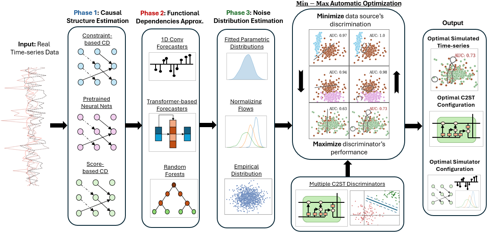

# Temporal Causal-based Simulation (TCS)


[](https://github.com/gkorgkolis/TCS/blob/main/LICENSE)
[](https://arxiv.org/abs/2506.02084)
[](https://www.codefactor.io/repository/github/gkorgkolis/tcs/overview/main)

Code for the paper "Temporal Causal-based Simulation for Realistic Time-series Generation", Gkorgkolis et al., 2025.  

## 📌 Overview

<p align="center" width="100%">
  
</p>

- **Problem**: Existing works on generating time-series data and their corresponding causal graphs often assume overly simplistic or closed-world simulation settings, evaluating generated datasets using unoptimized or single-metric approaches (e.g., MMD) which can be highly misleading and fail to reflect true data quality.

- **Contributions**:

  - Demonstrate that relying on unoptimized metrics for data quality assessment leads to unreliable conclusions (see Figure 1 of our paper).
  - Introduce a modular, model-agnostic pipeline for simulating realistic time-series data along with their time-lagged causal graphs.
  - Propose a Min-max AutoML scheme that selects the best simulation configuration using optimized classifier two-sample tests (C2STs), by minimizing over configurations $`c \in C`$ and maximizing over discriminators $`d \in D`$ (illustrated in the main figure).
  - Show that our method achieves comparable or superior generation across a diverse set of real, semi-synthetic, and synthetic time-series datasets.

## Installation

### 🐍 Using Conda

Create a virtual conda environment using 

- `conda env create -f environment.yaml`
- `conda activate TCS`

### Install requirements directly

Alternatively, you can just install the dependencies from the `requirements.txt` file, either on your base environment or into an existing conda environment using

`pip install -r requirements.txt`

## 🧪 Quick Start

Notebooks for reproducible experiments and demo scripts (`running_examples.ipynb`) are available in the `code/notebooks/` folder. Experimental results are available in `code/data/results/`.

## 📔 Available Notebooks

We provide various `.ipynb` notebooks not only for reproducing the experimental results of the paper but also for getting started with our codebase. Specifically:

- `exp_0_increasing_density.ipynb` contains experiments on the impact of using the sparsity penalty in the simulation on synthetic data against the number of edges
- `ex_1_dense_output.ipynb` contains an experiment on using a dense graph as input to the TCS algorithm from the 1st phase of TCS. It also contains our experimental results on using the ground truth graph (oracle graph) with the sparsity penalty (see Figures 3a and 3b of our paper)
- `exp_2_oracle_graph.ipynb` illustrates the behavior of TCS given the oracle graph as the 1st phase's output
- `exp_3_vs_baselines.ipynb` contains baseline comparisons between TCS, CausalTime and non-causal simulators (CPAR, TVAE) (Table 3 of our paper)
- `exp_4_cd_efficacy.ipynb` corresponds to our CD Efficacy experiments (Table 2 of our paper)
- `exp_5_random_output.ipynb` observes the behavior of TCS when choosing a random configuration from the TSCM space. This serves as a baseline method.
- `running_examples.ipynb` represents two running examples of the TCS codebase: (i) one running a single TCS simulation with a configuration of PCMCI Causal Discovery algorithm, gradient boosting predictor and spline noise estimators and (ii) an optimized TCS simulation with our proposed Min-max selection scheme.


## ✨ Pretrained Weights

CP Weights (to be optionally included in Phase 1 of TCS -see `simulation_configs.py`) are provided outside GitHub due to size constraints, in the following Google Drive links:

- [deep_CI_RH_12_3_merged_290k.ckpt](https://drive.google.com/file/d/1Syfse6nXr_vK7lfPEOEScl-4xbr0b_OJ/view?usp=drive_link)
- [lcm_CI_RH_12_3_merged_290k.ckpt](https://drive.google.com/file/d/1XZyhp1t9Kc015KDaIlwrw938aKnarYli/view?usp=drive_link)

The first model corresponds to $16.1M$ parameters, while the other to $391M$. 

## 📚 Citation

If the codebase has proven useful, please consider citing the following article:

```bibtex
@misc{gkorgkolis2025temporal,
      title={Temporal Causal-based Simulation for Realistic Time-series Generation}, 
      author={Nikolaos Gkorgkolis and Nikolaos Kougioulis and MingXue Wang and Bora Caglayan and Andrea Tonon and Dario Simionato and Ioannis Tsamardinos},
      year={2025},
      eprint={2506.02084},
      archivePrefix={arXiv},
      primaryClass={cs.LG},
      url={https://arxiv.org/abs/2506.02084}, 
}
```

## 🥰 Contributing

Contributions are welcome! Feel free to:
- Open issues for bugs, questions, or feature requests
- Submit pull requests for improvements or new functionality

We follow standard GitHub practices for contributions, see our [CONTRIBUTING](https://github.com/gkorgkolis/TCS/blob/main/CONTRIBUTING.md) file.
